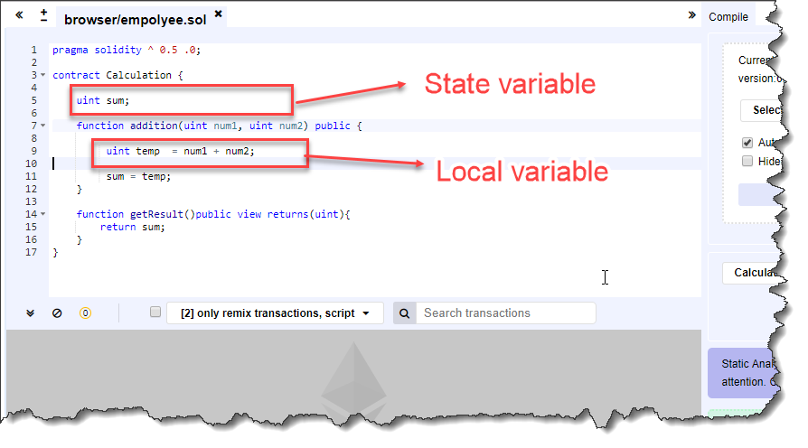

# Smart Contract Processing 

## Structure

- List of Functions: 
    - Constructor 
    - Fallback 
    - View 
    - Pure 
    - Public
    - Private 
    - Internal
    - External
- User defined types in struct and enums
- Modifiers
- Events

## Processing and Deploying 

- Smart Contract needs an address to get deployed and invoke its function.
- Address computed by hashing the account and nounce.
- ABI(Application Binary Interface) generated for HLL applications.
- EVM provies execution environment for smart contract bytecode.

# REMIX

- Remix is a powerful, open source tool that helps us to write Solidity contracts straight from the browser. Written in JavaScript, Remix supports both usage in the browser and locally.

- Remix also supports testing, debugging and deploying of smart contracts and much more.

# What is Solidity?

Solidity is an object-oriented programming language created for the Ethereum network or the Ethereum Virtual Machine (EVM) so to say, to implement smart contracts. According to the official documentation, it is a curly bracket language.

If you are somewhat familiar with Python, C++, or JavaScript, then you will find it easier to learn Solidity because of its similarity with those languages. Like most other languages, this language too supports inheritance, libraries, tools, and complex user-defined types, making coding easier for developers.

Solidity files are identified by a ‘.sol’ file extension name. It is a statically typed language. While I write, the latest stable version of Solidity released is v0.8.15. you can find the link to the [Solidity official docs](https://docs.soliditylang.org/en/v0.8.15/) by clicking here.

## What are Smart Contracts?

Smart contracts are nothing but applications or programs on the Ethereum network, that administer how accounts on the network behave.

They are nothing but programs or applications stored on decentralized blockchains. They run when predetermined conditions are met and are commonly used to automate the execution of an agreement.

Here’s a simple smart contract code is written in Solidity:

```solidity
pragma solidity ^0.5.0; //(PRE-COMPILER LINE)this compiler will be selected and "^" is for upward compatibility

contract MyContract {
    string public myString = "Hello World"; // visibiltiy = public here
}
```
Read here in detail about [Smart Contracts](https://www.ibm.com/topics/smart-contracts).

# Access Modifier
 
Access Modifiers are the keywords used to specify the declared accessibility of a function or a type. There are four access modifiers available in Solidity.
 
## Public
 
The Public element can be inherited and can be accessed by external elements. All can access a public element. 
 
## Private
 
The Private element doesn’t get inherited and can't be accessed by external elements. It can be accessed from the current contract instance only. 
 
## Internal
 
The Internal element can be inherited but can’t be accessed by external elements. Only the base contract and derived contract can access internal element.
 
## External
 
The External element can’t be inherited but it can be accessed by external elements. Current contract instance can’t access external element, it can be accessed externally only.
 
# Variable Declaration 
 
Variable declaration in Solidity is a bit different; you have to specify the type (data type) first, followed with an access modifier, and the variable name. If you would not specify any access modifier, it will be considered as a private.  
 
**Structure**
```solidity
<type> <access modifier> <variable name> ;  
```
**Example**
```solidity
uint public temp;
```   
There are mainly two types of variables available in Solidity - **State variables** and the **Local variables**. We consider them as Global variables and Local variables just as any other language. Though, there are some differences.
 
## State variable
 
State variables store the value permanently in the contract storage. Consider that you’re using C# or other languages and you want to store user information for a long time, what would you do? Connect your application with a database server and then save that information to the DB. However, in Solidity, no need to make a connection, you can easily store your data permanently with just the use of state variables. 
 
Each method has its own scope, and the State variables should define outside of the scope of any defined functions.
 


## Local Variable
 
The context of a local variable is within the function, and it cannot be accessed outside. Usually, these variables are used to hold temporary values for processing or calculating something. “temp” in the upper screen is a local variable, which we cannot use outside of “addition” function.

# Functions

- Reading transaction = call , Writing transaction = trans
- View - Reading from state, view and pure functions.
- Pure - Not reading or modifying state, call only pure functions.
- Constructor - called at the time of deployment.
- Receive - For directly sending ether from an account to a smart contract.

# Require, Assert and Revert 

- Errors revert the state.
- Revert and require can return an error string .
- Require - returns remaining gas, used for validating user input 
- Assert - consume all gas, used to validate invariants, terminates transaction.
- Revert - reverts the transaction and returns gas.

# Modifiers

- Automatically check a pre-condition.
- Change the behaviour of functions.

# Important Properties 

- msg.sender - address of account calling the function
- msg.value - amount of ether sent by the caller of the function (gives amount in wei, 1 ether = 10^18 wei)
- now - the timestamp currently ([Epoch time](https://www.epochconverter.com/) - 10 digit number, every seconds add 1 to it, started from 1 Jan 1970)
- selfdestruct(address); The Smart contract state won't be there anymore.

> If you send a transaction or funds to a self-destructed contract you will lose your funds.

# Inheritance

<!-- It is basically reusing of code. Private functions cannot be inherited. -->
- Using "**is**" keyword 
- Inherited contracts are deployed as a single contract, not seperate ones.
- Reusing of code. For example - 
    Contract A{}
    contract B **is** A{}

# Importing of Files

<!-- 4 ways of importing files -->
- Global level : import "filename"
- Import all members of a file : import* **as** symName from "filename";
- Import specific members fo a file : import{symbol1 as alias} from "filename"
- import from github : example - import "https://github.com/OpenZeppelin/openzeppelin-contracts/blob/v2.5.0/contracts/ownership/Ownable.sol";

# Events And Return Values

- EVM has a logging functionality
- Events : inform external users that some action has happened.
```solidity
eventmyEvent(DT1arg1, address indexed arg2);  
// The indexed parameters for logged events will allow to search for these events using the indexed parameters as filters.
emit myEvent(amt, address);
// by emit the client gets to know that some changes have been made
```
Return values, trigger functionality and cheap storage
- Data storage : off-chain data storage or store in IPFS(InterPlanetary File System).
> (IPFS) is a protocol and peer-to-peer network for storing and sharing data in a distributed file system.
- Apps can subscribe and listen to these events through the RPC(Remote procedure call) inteface of an Ethereum client.
> In distributed computing, a remote procedure call (RPC) is when a computer program causes a procedure (subroutine) to execute in a different address space (commonly on another computer on a shared network), which is coded as if it were a normal (local) procedure call, without the programmer explicitly coding the details for the remote interaction.
- Not accessible from within contracts.

# WEB3.JS

- The web3, js library is a collection of modules that contain functionality for the ethereum  ecosystem.
- It is a javascript library which is isomorphic(use it for both front-end and back-end).
- web3-eth is for the ethereum blockchian and smart contracts. 
- web3-shh is for the whisper protocol, to communicate p2p and broadcast.
- web3-bzz is for the swarm protcol, the decentralized file storage.
- web3-utils contains useful helper functions for Dapp(decentralized application) developers.